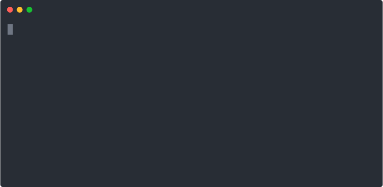
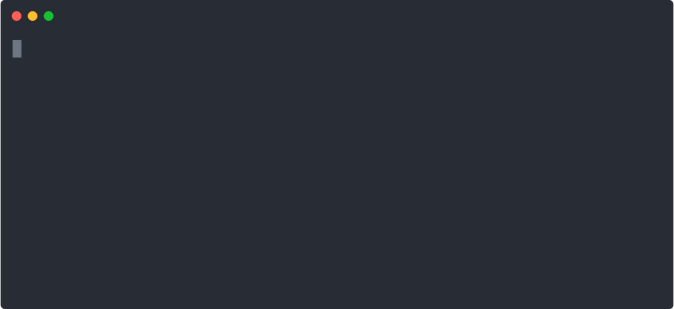

# Website Evidence Collector

The tool _Website Evidence Collector_ (WEC) automates the website evidence collection of storage and transfer of personal data. It is based on the browser Chromium/Chrome and its JavaScript software library for automation [puppeteer].

[puppeteer]: https://developers.google.com/web/tools/puppeteer/

## Installation



1. Install Node.js and the Node.js package manager (NPM). The minimum version for Node.js is 16.0.
   - Windows or Mac: Follow the guide on <https://nodejs.org/en/>.
   - Linux: Use the Linux package manager to install Node.js (e.g., `zypper in nodejs10` or `apt install nodejs`), or use the node version manager and follow instructions on <https://nodejs.org/en/download/package-manager>

2. Install the Website Evidence Collector using one of the following methods:
   - From the EDPS Website: Download the tarball archive file (`*.tar.gz`) and run:
     ```bash
     npm install --global ./website-evidence-collector-*.tar.gz
     ```
     (Replace `*` with the current release version)
   - From GitHub (latest stable version):
     ```bash
     npm install --global https://github.com/EU-EDPS/website-evidence-collector/tarball/latest
     ```
   - From GitHub (potentially unstable testing version):
     ```bash
     npm install --global https://code.europa.eu/EDPS/website-evidence-collector/-/archive/master/website-evidence-collector-master.tar
     ```

3. Set up the Website Evidence Collector by running:
   ```
   npm run setup
   ```

To uninstall the tool, use:
```
npm uninstall --global website-evidence-collector
```

### Note on Permissions

If you encounter permission denied errors during installation, try the following commands:

```bash
mkdir "${HOME}/.npm-packages"
npm config set prefix "${HOME}/.npm-packages"
```

---

## Run Website Evidence Collector

The WEC can be ru in two ways. Either using the `collect` command on the command line, saving its output in a folder or using the `serve` command starting a webserver which can be accessed using the browser. The serve command is recommended for quick and simple scans.

**Notice on the Processing of Personal Data:** This tool carries out automated processing of data of websites for the purpose of identifying their processing of personal data. If you run the tool to visit web pages containing personal data, this tool will download, display, and store these personal data in the form of text files and screenshots, and you will therefore process personal data.

**Hint:**
If you run into command not found errors you have to add the `.npm-packages` to your `PATH`.  
Run the following commands:

`NPM_PACKAGES="${HOME}/.npm-packages"`  
`export PATH="$PATH:$NPM_PACKAGES/bin"`

You can check your `PATH` with this command: `echo $PATH`.

### serve


The `serve` command starts a local web server to display the collected evidence.

```shell
website-evidence-collector serve
```

By default, the website is available at http://localhost:8080/.

You can customize the server port and browser options:

- Use `--port` or `-p` to specify a different port.
- Use `--browser-options` to pass additional options to the internal Chromium browser. (You can provide multiple `--browser-options` flags, each with a single option.)

Example with custom port and browser options:

```shell
website-evidence-collector serve -p 8081 --browser-options='--disable-webgl' --browser-options='--disable-gpu'
```

### collect


The `collect` command is the default command for WEC when no other options are provided. It runs a collection from the terminal and saves the result in the output folder by default.

#### Basic Usage

```shell
website-evidence-collector https://example.com
```

#### Command-line Options

1. **Simple output on the terminal only:**
   ```shell
   website-evidence-collector --no-output --yaml https://example.com 2> /dev/null
   ```
   This displays the output on the terminal and redirects logging to `/dev/null`.

2. **Ignore certificate errors during collection:**
   ```shell
   website-evidence-collector -y -q https://untrusted-root.badssl.com -- --ignore-certificate-errors
   ```
   This ignores certificate errors when collecting data from the specified URL.

   All command line arguments after `--` (the second in case of `npm`) are applied to launch Chromium.

   Reference: <https://peter.sh/experiments/chromium-command-line-switches/#ignore-certificate-errors>

3. **Integrate with testssl.sh:**

   **Note:** [Testssl.sh](https://testssl.sh/) v3.0 or higher must be already installed. The most recent and with WEC tested version is [v3.0.6](https://github.com/drwetter/testssl.sh/releases/tag/v3.0.6).

   With the option `--testssl`, the website evidence collector calls `testssl.sh` to gather information about the HTTPS/SSL connection.

   a. Basic usage:
   ```shell
   website-evidence-collector --testssl https://example.com
   ```
   b. Specify testssl.sh executable location:
   ```shell
   website-evidence-collector -q --testssl-executable ../testssl.sh-3.0.6/testssl.sh https://example.com
   ```
   c. Use a pre-existing testssl.sh JSON output file:
   ```shell
   website-evidence-collector --testssl-file example-testssl.json https://example.com
   ```

## Docker/Podman Container

A Docker/Podman container is available as a `Containerfile` for easy deployment:
- Build the Container (or use docker equivalent):
  ```shell
   podman build -t website-evidence-collector -f Containerfile
  ```
- To run the WEC server, forward the port:
  ```
  podman run -p 8080:8080 localhost/website-evidence-collector
  ```

- To collect evidence and save output, map a volume:
  ```  
  podman run -v /path/on/your/system:/output:z --userns=keep-id localhost/website-evidence-collector collect https://example.com
  ```

## Frequently Asked Questions

Please find a collection of frequently asked questions with answers in [FAQ.md](FAQ.md)

## Setup of the Development Environment

1. Install the dependencies according to the Installation Guide point 1.
2. Install the version control system _Git_ (<https://git-scm.com/>).
3. Download the Website Evidence Collector
   a. from the [EDPS Website](https://edps.europa.eu/press-publications/edps-inspection-software_en) and unpack the received folder with e.g. [7zip](https://www.7-zip.org), or
   b. from Git repository with `git clone https://code.europa.eu/EDPS/website-evidence-collector.git`.
4. Open the terminal and navigate to the folder `website-evidence-collector`.
5. Install the dependencies and compile TypeScript using `npm run setup`
6. Consider to use `npm link` to make the command `website-evidence-collector` outside of the project folder.

## TODO List

- some recorded HTTP cookies have not yet information on their origin (log data)
- fix bugs in HAR creation and verify accuracy, see <https://github.com/Everettss/puppeteer-har/issues> and [New HAR page doesn't appear to be created upon navigation chrome-har#19](https://github.com/sitespeedio/chrome-har/issues/19)
- optionally store web pages matching the keywords in markdown format, see <https://justmarkup.com/articles/2019-01-04-using-puppeteer-to-crawl-pages-and-save-them-as-markdown-files/>
- [puppeteer does not fully support PDF and downloads](https://github.com/puppeteer/puppeteer/issues/2794), so that if `--max` is used to browse random links, the script skips links to content with different mime type than `text/html` and scans effectively less pages
- client-side redirects using e.g. `<meta http-equiv="refresh" content="1;URL='https://example.com'"/>` are followed, but not mentioned in the output
- in releases after v1.0.0, the option `--quiet` has no effect any longer – instead debug output is printed to STDERR and can only be disregarded with `2> /dev/null`
- the library `got` does not support the `require()` syntax anylonger since version 12; it seems all use of `require()` must be migrated to `import` for all packages
- the library `puppeteer-har` is basically unmaintained and should be replaced by a fork. https://github.com/auteon/puppeteer-har/ provides a good starting point, but yields an install error as drop-in-replacement

## Third-Party Software

The following software extends WEC to cover further use cases. It is developed independently of the WEC and is not tested or approved by the WEC developers.

- Test Runner to automated Website Evidence Collector for continuous testing <https://github.com/perploug/wec-testrunner>
- A tool to launch website-evidence-collector on several URLs or Sitemaps and generate a full report <https://github.com/ovh/website-evidence-collector-batch>
- A tool that incorporates many ideas of the WEC (but not the WEC itself) to analyse websites <https://github.com/the-markup/blacklight-collector>
- Dashboard to monitor several sites of your organisation for privacy requirements like third parties, cookies and just plain privacy violators <https://github.com/vincentcox/privacy-dashboard>

## Resources for Developers

- puppeteer sandbox online: <https://puppeteersandbox.com/>
- opensource puppeteer sandbox: <https://github.com/ebidel/try-puppeteer>, online at <https://try-puppeteer.appspot.com/>
- puppeteer API documentation: <https://pptr.dev/>
- puppeteer examples: <https://github.com/checkly/puppeteer-examples>
- puppeteer with chrome-as-a-service: <https://github.com/joelgriffith/browserless>
- stacktrace.js documentation: <https://www.stacktracejs.com/#!/docs/stacktrace-js>
- Chrome DevTools Protocol Documentation: <https://chromedevtools.github.io/devtools-protocol/>

## Contributors

- Robert Riemann (European Data Protection Supervisor, initial author)
- Company BitnessWise <https://www.bitnesswise.com/> (code to preset cookies, bug fixes)
- Roland Schilling ([DPA Hamburg](https://datenschutz-hamburg.de/))
- Company Avast <https://www.avast.com> (store page source code in output folder [#68](https://github.com/EU-EDPS/website-evidence-collector/pull/68))
- Per Ploug (Zalando) <https://opensource.zalando.com/> (refactor code base for modularity)

## License

This work, excluding filter lists, is distributed under the European Union Public Licence (the ‘EUPL’). Please find the terms in the file [LICENSE.txt](./LICENSE.txt).

Filter lists in the `assets/` directory are authored by the EasyList authors (<https://easylist.to/>) and are for your convenience distributed together with this work under their respective license as indicated in their file headers.
